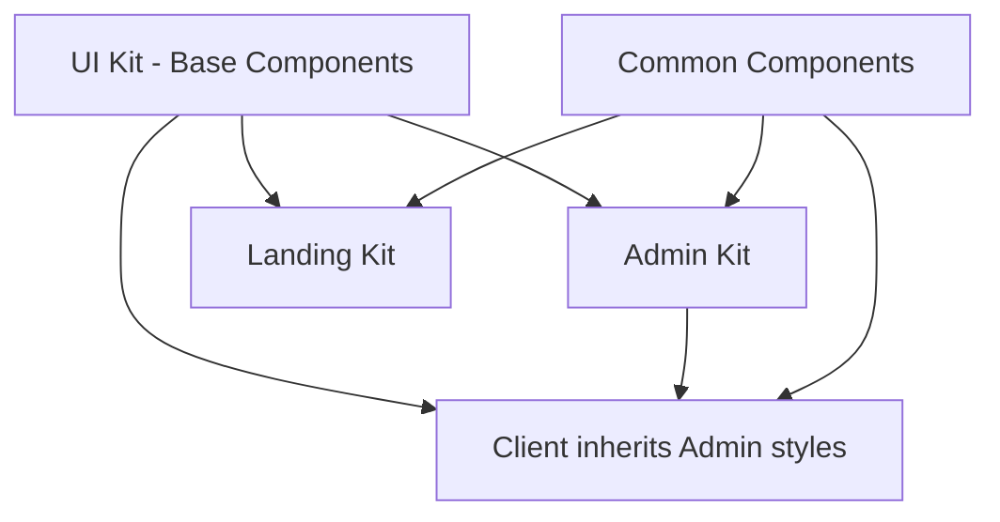

# 🎨 SGPT Frontend UI Kit System

**Comprehensive component library organized into distinct kits for scalable development**

---

## 🏗️ **Architecture Overview**

The SGPT frontend is organized into **4 distinct UI kits**, each serving specific purposes and user types:

```
frontend/src/components/
├── 🚀 landing/          # Public marketing pages
├── 🎨 admin/            # Administrative interface  
├── 🎯 client/           # Client-facing application
├── 🧩 ui/               # Base UI components (shared)
└── 🔧 common/           # Shared utilities & layout
```

---

## 📦 **Kit Structure**

### 🚀 **Landing Kit** (`/landing/`)
**Purpose:** Public-facing marketing and conversion pages
- **Target Users:** Potential customers, website visitors
- **Components:** Hero sections, pricing tables, feature showcases, testimonials
- **Styling:** Conversion-optimized with SGPT brand colors
- **Documentation:** [Landing Kit README](./landing/README.md)

### 🎨 **Admin Kit** (`/admin/`)
**Purpose:** Administrative dashboard and system management
- **Target Users:** System administrators, support staff
- **Components:** Monitoring dashboards, user management, system controls
- **Styling:** Professional dark theme with red accents
- **Documentation:** [Admin Kit README](./admin/README.md)

### 🎯 **Client Kit** (`/client/`)
**Purpose:** Client-facing application interface
- **Target Users:** End users, email marketers, campaign managers
- **Components:** Campaigns, analytics, email tools, templates
- **Styling:** Inherits admin base with user-friendly enhancements
- **Documentation:** [Client Kit README](./client/README.md)

### 🧩 **UI Kit** (`/ui/`)
**Purpose:** Base components shared across all kits
- **Target:** All interfaces
- **Components:** Buttons, inputs, modals, tables, forms
- **Styling:** Foundational design system components
- **Documentation:** [UI Kit README](./ui/README.md)

---

## 🎯 **Design Inheritance System**



**Inheritance Chain:**
1. **UI Kit** → Provides foundational components
2. **Admin Kit** → Professional admin interface
3. **Client Kit** → Inherits admin base + user-friendly enhancements
4. **Landing Kit** → Marketing-optimized standalone design
5. **Common Kit** → Shared utilities used by all

---

## 🎨 **CSS Organization**

### Structured Styling System
```
frontend/src/styles/
├── kits/
│   ├── landing.css      # Landing page styles
│   ├── admin.css        # Admin interface styles
│   └── client.css       # Client interface styles
├── components/          # Component-specific styles
└── utilities/           # Utility classes
```

### Design Tokens
```css
:root {
  /* SGPT Brand Colors */
  --primary: hsl(0 72% 51%);        /* SGPT Red */
  --background: hsl(0 0% 3.9%);     /* Dark Background */
  --foreground: hsl(0 0% 98%);      /* Light Text */
  --secondary: hsl(0 0% 14.9%);     /* Card Backgrounds */
  --border: hsl(0 0% 14.9%);        /* Borders */
}
```

---

## 🚀 **Quick Start Guide**

### 1. **Using Landing Components**
```typescript
import { HeroSection, FeatureGrid, PricingSection } from '@/components/landing';

<LandingPage>
  <HeroSection variant="gradient">
    <HeroTitle>AI-Powered Email Marketing</HeroTitle>
    <HeroCTA primaryText="Start Free Trial" />
  </HeroSection>
  <FeatureGrid features={features} />
  <PricingSection plans={plans} />
</LandingPage>
```

### 2. **Using Admin Components**
```typescript
import { AdminLayout, AdminCard, AdminMetrics } from '@/components/admin';

<AdminLayout>
  <AdminMetrics data={systemStats} />
  <AdminCard title="User Management">
    <UserTable users={users} />
  </AdminCard>
</AdminLayout>
```

### 3. **Using Client Components**
```typescript
import { ClientLayout, CampaignCard, AnalyticsChart } from '@/components/client';

<ClientLayout>
  <div className="client-dashboard-grid">
    <CampaignCard campaign={activeCampaign} />
    <AnalyticsChart data={performanceData} />
  </div>
</ClientLayout>
```

---

## 📱 **Responsive Design Strategy**

### Breakpoint System
- **Mobile:** `< 768px` - Single column, touch-optimized
- **Tablet:** `768px - 1024px` - Two column grids
- **Desktop:** `> 1024px` - Full multi-column layouts
- **Large:** `> 1280px` - Enhanced spacing and content

### Mobile-First Approach
All components are built mobile-first with progressive enhancement:
```css
/* Base mobile styles */
.component { @apply flex-col; }

/* Tablet enhancement */
@media (min-width: 768px) {
  .component { @apply flex-row; }
}

/* Desktop enhancement */
@media (min-width: 1024px) {
  .component { @apply gap-8; }
}
```

---

## ♿ **Accessibility Standards**

### WCAG 2.1 AA Compliance
- **Keyboard Navigation:** Full keyboard support
- **Screen Readers:** ARIA labels and descriptions
- **Color Contrast:** Minimum 4.5:1 ratio
- **Focus Management:** Visible focus indicators

### Implementation
```typescript
// Example accessible component
<button
  aria-label="Create new campaign"
  aria-describedby="campaign-description"
  className="client-btn-primary focus:ring-2 focus:ring-red-500"
>
  Create Campaign
</button>
```

---

## 🔧 **Development Guidelines**

### Component Structure
```typescript
// Standard component template
interface ComponentProps {
  children?: React.ReactNode;
  className?: string;
  variant?: 'default' | 'primary' | 'secondary';
}

export const Component: React.FC<ComponentProps> = ({
  children,
  className,
  variant = 'default'
}) => {
  return (
    <div className={cn(baseClasses, variantClasses[variant], className)}>
      {children}
    </div>
  );
};
```

### Naming Conventions
- **Components:** PascalCase (`HeroSection`, `AdminCard`)
- **Props:** camelCase (`primaryText`, `isLoading`)
- **CSS Classes:** kit-component-modifier (`client-btn-primary`)
- **Files:** kebab-case (`hero-section.tsx`)

### Performance Guidelines
- **Lazy Loading:** Components loaded on demand
- **Code Splitting:** Kit-based bundle separation
- **Memoization:** React.memo for expensive components
- **Bundle Size:** Monitor and optimize bundle sizes

---

## 📊 **Kit Usage Analytics**

### Component Distribution
- **Landing Kit:** ~15 components (Hero, Features, Pricing, etc.)
- **Admin Kit:** ~25 components (Dashboard, Monitoring, Management)
- **Client Kit:** ~35 components (Campaigns, Analytics, Tools)
- **UI Kit:** ~40 components (Base components for all)
- **Common Kit:** ~10 components (Layout, Navigation, Utilities)

### Bundle Sizes (Target)
- **Landing:** < 150KB (marketing-optimized)
- **Admin:** < 300KB (feature-rich)
- **Client:** < 400KB (most comprehensive)
- **Shared:** < 100KB (base components)

---

## 🔄 **Migration Guide**

### From Legacy Structure
```bash
# Old structure
components/scattered-components/

# New structure  
components/
├── landing/
├── admin/
├── client/
└── ui/
```

### Import Updates
```typescript
// Before
import { Component } from '@/components/Component';

// After - Kit-based imports
import { Component } from '@/components/admin';
import { Component } from '@/components/client';
import { Component } from '@/components/landing';
```

---

## 🧪 **Testing Strategy**

### Component Testing
- **Unit Tests:** Individual component functionality
- **Integration Tests:** Kit-level component interactions
- **Visual Tests:** Screenshot testing for UI consistency
- **Accessibility Tests:** Automated a11y testing

### Test Organization
```
__tests__/
├── unit/
│   ├── landing/
│   ├── admin/
│   ├── client/
│   └── ui/
└── integration/
    └── kit-interactions/
```

---

## 📈 **Performance Monitoring**

### Metrics Tracked
- **Bundle Size:** Per-kit bundle analysis
- **Load Time:** Component lazy loading performance
- **Runtime Performance:** React profiler metrics
- **Accessibility Score:** Lighthouse accessibility audit

---

## 🛠️ **Maintenance & Updates**

### Version Management
- **Kit Versioning:** Independent kit versioning
- **Breaking Changes:** Clear migration guides
- **Deprecation:** Graceful component deprecation
- **Documentation:** Always up-to-date documentation

### Update Process
1. Update individual kit components
2. Test kit-level functionality
3. Verify cross-kit compatibility
4. Update documentation
5. Release with semantic versioning

---

This organized structure ensures **scalability**, **maintainability**, and **consistency** across the entire SGPT frontend application.